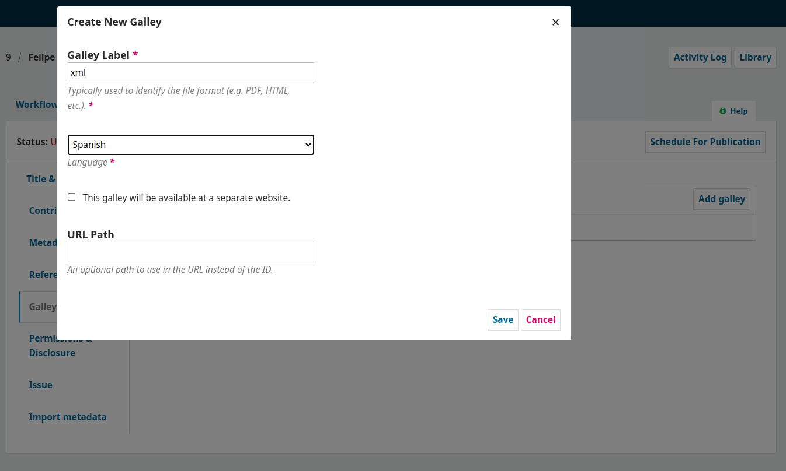
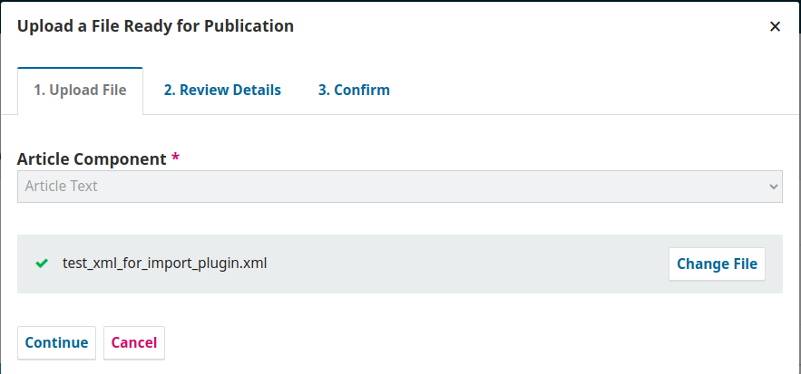
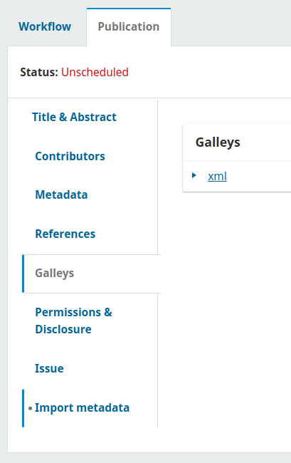

# Import metadata from XML

This plugin load publcation metadata from a XML galley.

works in OJS 3.4.x

## Instructions
### Plugin Installation Guide for OJS

You can install this plugin in two ways:

#### 1. Upload via the OJS Web Interface
- Go to the **Dashboard** > **Website Settings** > **Plugins**.
- Click on **Upload a New Plugin**.
- Select the plugin `.tar.gz` or `.zip` archive and upload it.
- Once installed, make sure to **enable** the plugin.

#### 2. Manual Installation
- Upload or extract the plugin folder into the appropriate directory:
  - ojs/plugins/generic
- Activate plugin from plugin from "Website -> Plugins"

### Plugin Usage
* In the submission desired, add galley
    - 
* Upload xml for import metadata
    - 
* Apply "Import metadata"
    - 
* Review metadata added, title, description, colaborators, references, etc...

## Improvements and Revisions
- [x] **Does not fetch author/contributor emails -> Feature**
  - Replaces it with the main contact -> sometimes
  - Depends on the XML file
    - The reported XML format is different from previously used ones
      - Consider the new format to save contributor emails -> **Feature** -> ✔️
- [x] **Keywords are not inserted in any language -> Feature**
  - Requires proper language configuration in the journal settings
  - Issues with multiple languages and the language set in the XML
  - Conflict with XMLs that include JEL codes -> **Feature** -> ✔️
- [x] **JEL Code -> A field specifically inserted for certain journals -> Feature**
  - Use it as keywords -> **Feature** -> ✔️
  - Insert it into all languages -> ✔️
- [x] **Funding agencies -> Feature**
  - Only in one language -> Show the same in all available languages -> **Feature** -> ✔️
  - Does not capture the entire text
    - Extract the `funding-statement` tag -> **Feature** -> ✔️
- [x] **Abstract: Check if the text is formatted correctly (bold, etc.) -> Feature**
  - Currently discards title tags (summary) and includes only the content -> ✔️
  - Titles (if specified) should be included, except generic ones (summary) -> ✔️
  - Style (bold, italic) is important in both title and body -> ✔️
  - Links to references may occasionally appear, but they should not be incorporated -> ✔️
- [x] **Contributors: Inserts collaborators only in Spanish -> Feature**
  - Verify if the Role is fetched correctly -> ✔️
  - Affiliation: Verify -> ✔️
- [x] **References: Inserted in a seemingly incorrect format -> Feature**
  - A function is added to clean unwanted spaces in the text
- [x] **Add security to hide the button based on user role -> Feature**
  - Only allow Managers and Editors
- [x] **Titles and subtitles: Manage secondary languages (trans-titles) or use defaults as is -> Feature**
- [x] **DOI: Now in a separate section and not being registered -> ✔️**
  - It is generating an incorrect DOI; it should fetch it from the XML.
- [x] **Refactor**
- [x] **Languages: Review language handling**
  - Use those from the XML and those configured in the journal->publication settings